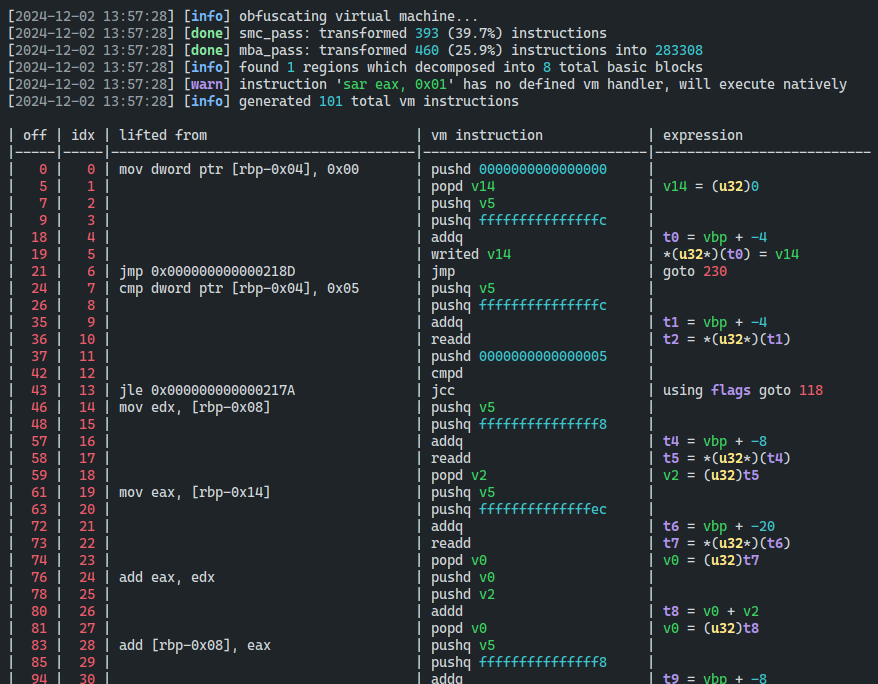
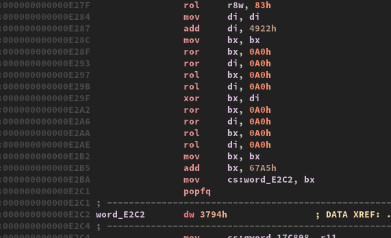

# covirt 

An x86-64 code virtualizer for VM based obfuscation.

## Features

- Stack-based virtual machine architecture
- MBA, self-modifying code obfuscation
- Support for both PE* and ELF binaries
- Code markers to define protected regions

*\*PE support only tested on binaries compiled via MinGW-w64*

# Getting started

## Dependencies

`CMake` will fetch all these dependencies, so installing them yourself is not necessary.

| Name | Version |
| ---- | ------- |
| [CMake](https://cmake.org/) | 3.25+ |
| [Zydis](https://github.com/zyantific/zydis) | 4.1.0+ |
| [zasm](https://github.com/zyantific/zasm) | Latest |
| [LIEF](https://github.com/lief-project/LIEF) | 0.15.1+ |

## Building

A `C++23` compatible compiler is required in order to build.

```bash
git clone https://github.com/dmaivel/covirt.git
cd covirt
mkdir build
cd build
cmake ..
cmake --build . --config Release
```

If you are compiling on Windows via Visual Studio, you must use `clang-cl`: `cmake .. -T ClangCL -A x64`.

# Usage

```bash
Usage: covirt [--help] [--version] [--output OUTPUT_PATH] [--vm_code_size MAX] [--vm_stack_size SIZE] [--no_self_modifying_code] [--no_mixed_boolean_arith] [--show_dump_table] INPUT_PATH

Code virtualizer for x86-64 ELF & PE binaries

Positional arguments:
  INPUT_PATH                         path to input binary to virtualize 

Optional arguments:
  -h, --help                         shows help message and exits 
  -v, --version                      prints version information and exits 
  -o, --output OUTPUT_PATH           specify the output file [default: INPUT_PATH.covirt] 
  -vcode, --vm_code_size MAX         specify the maximum allowed total lifted bytes [default: 2048]
  -vstack, --vm_stack_size SIZE      specify the size of the virtual stack [default: 2048]
  -no_smc, --no_self_modifying_code  disable smc pass 
  -no_mba, --no_mixed_boolean_arith  disable mba pass 
  -d, --show_dump_table              show disassembly of the vm instructions
```

## Code markers

For `covirt` to know which functions need to be virtualized, you must add the start and end markers into your source code, like so:

```c
#include "covirt_stub.h"

int my_function(...)
{
    int result = 0;
  
    __covirt_vm_start();
    // ...
    __covirt_vm_end();

    return result;
}
```

> [!IMPORTANT]
>  - Do not place `__covirt_vm_end` in unreachable locations (i.e. after a return), as it will prevent the end stub from emitting
>  - `__covirt_vm_...();` stubs won't work using `MSVC` because they use inline assembly
>  - `SSE4` support is required

## Demo



```c
#include <covirt_stub.h>
#include <stdio.h>

int calculate(int a, int b)
{
    int result = 0;

    __covirt_vm_start();
    
    for (int i = 0; i < 10; i++)
        if (i > 5)
            result += result + a;
        else
            result += (result >> 1) + b;
    printf("result = %d\n", result);

    __covirt_vm_end();

    return result;
}

int main()
{
    calculate(5, 12);
}

```

The example application above was virtualized using `covirt a.out -d`, which outputs a dump of the VM instructions following obfuscation and virtualization. The current VM implementation pushes most operands onto the stack to process them, reducing the complexity of encoding the VM instructions. For instructions that don't have a defined VM handler, they will be executed natively (`vm_exit` -> `native instruction` -> `vm_enter`). Calling functions follows the same pipeline, in which we exit, call the function, and reenter the VM. All together, the transformations make the binaries grow significantly in size:
 - `a.out` as an `ELF`: 15.5 kB -> 1.0 MB
 - `a.out` as a `PE`: 259.3 kB -> 1.3 MB

## Obfuscation

| Description | IDA |
|-|-----------------|
IDA decompilation of `vm_entry`, which has been obfuscated via the MBA pass only. Over 27k LOC were generated by the decompiler. | 
IDA disassembly of `vm_entry`, which has been obfuscated via the MBA & SMC passes. Decompilation doesn't work. | 

## Known issues
- **Can't call another VM protected function from within a protected region**
  - Causes segfault if VM is obfuscated
  - No return value if VM isn't obfuscated 
